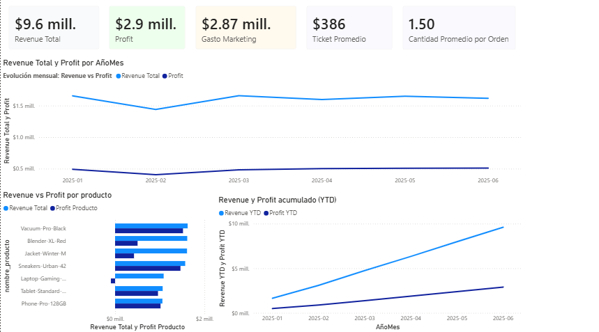
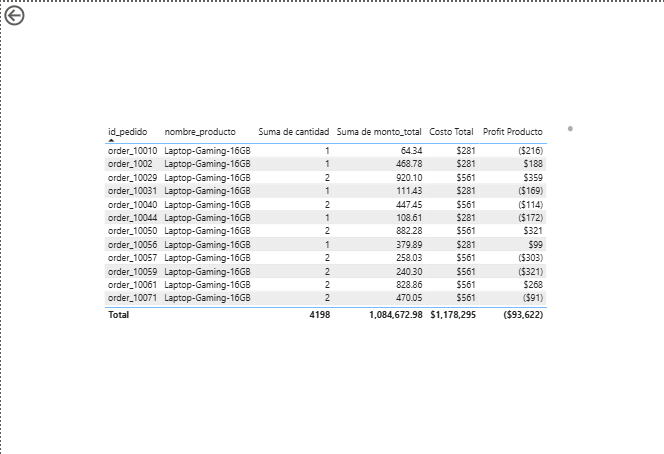
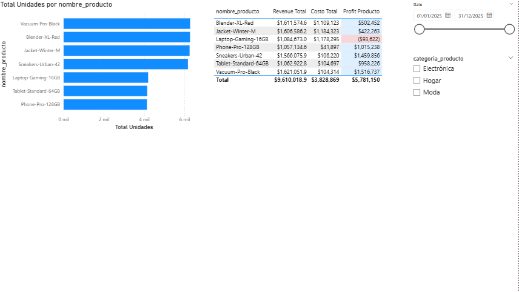

# 📊 Proyecto RappiPlus: De datos a decisiones de negocio

Análisis de datos de extremo a extremo sobre **RappiPlus**, un servicio de suscripción
diseñado para aumentar la frecuencia de compra y el valor por usuario. El proyecto
evalúa el desempeño del servicio y traduce los datos en recomendaciones accionables
de negocio, recorriendo todo el ciclo: **limpieza → KPIs → funnel → cohortes →
test estadístico → dashboard**.

## 🛠️ Tecnologías utilizadas

| Herramienta | Uso |
|-------------|-----|
| **Python** (pandas, statsmodels) | Limpieza de datos, cálculo de KPIs, test estadístico |
| **SQL** (PostgreSQL) | Análisis de funnel y retención por cohortes |
| **Power BI** (DAX) | Dashboards interactivos con drill-through |
| **Jupyter Notebook** | Entorno de desarrollo del análisis |

## ❓ Preguntas de negocio

El proyecto responde a seis preguntas clave:

1. ¿Podemos confiar en los datos?
2. ¿El negocio es rentable?
3. ¿Dónde se pierden los usuarios?
4. ¿Los usuarios regresan?
5. ¿Los cambios generan impacto?
6. ¿Cómo comunicamos los resultados?

## 📂 Fuentes de datos

- Pedidos, precios, descuentos e ingresos
- Costos, categorías y proveedores de productos
- Inversión en marketing por canal y país
- Tablas SQL (`events`, `users`, `user_activity`) — comportamiento de usuarios
- Resultados de un experimento A/B en el checkout

---

## 🔎 Proceso y hallazgos

### Paso 1 — Limpieza y calidad de datos (Python)
Se depuró un dataset de **25,100 pedidos**, corrigiendo:
- 100 filas duplicadas
- Valores nulos en columnas clave y descriptivas
- Países con formato inconsistente y categorías sin unificar
- **10 pedidos con cantidades absurdas (10,000–20,000 unidades)** que inflaban el
  revenue de $9.6M real a más de $50M ficticios

➡️ **Resultado:** 24,906 registros confiables para el análisis.

### Paso 2 — Rentabilidad del negocio (Python)
| KPI | Valor |
|-----|-------|
| Revenue total | $9.61M |
| Costo de productos | $3.83M |
| Gasto en marketing | $2.87M |
| **Profit** | **$2.91M** |
| **Margen** | **30.3%** |

➡️ **El negocio es rentable**, con el marketing (~30% del revenue) como la mayor
palanca de optimización.

### Paso 3 — Funnel de conversión (SQL)
Se construyó el funnel `first_visit → select_item → add_to_cart → begin_checkout →
add_payment_info → purchase`.

➡️ **Conversión final del 80%**, pero la mayor fuga está entre `begin_checkout` y
`add_payment_info`: **se pierde el 13.3% de los usuarios (958 personas) en el paso
de ingresar el pago.**

### Paso 4 — Retención por cohortes (SQL)
Se analizó la retención semanal por mes de registro.

➡️ Retención **estable en ~42%** en todas las cohortes. Quien sigue activo la primera
semana se queda, pero **~58% no regresa tras registrarse** — la mayor oportunidad
está en el *onboarding*.

### Paso 5 — Test A/B de la UI del checkout (Python)
Se comparó la conversión entre la UI actual (control) y una nueva (tratamiento)
mediante un **z-test de proporciones** (α = 0.05).

| Grupo | Conversión |
|-------|-----------|
| Control | 15.69% |
| Tratamiento | 16.29% |

➡️ Con **p = 0.4161 > 0.05**, la diferencia **no es estadísticamente significativa**.
No hay evidencia de que la nueva UI mejore la conversión: se recomienda no implementarla.

### Paso 6 — Dashboard en Power BI
Dos dashboards interactivos:
- **Overview Ejecutivo:** tarjetas KPI, evolución mensual de revenue/profit, acumulado
  YTD y ranking de rentabilidad por producto.
- **Detalle / Drill-through:** tabla con formato condicional, unidades vendidas por
  producto, y navegación drill-through para explorar los pedidos de cada producto.

| Overview Ejecutivo | Detalle / Drill-through |
|---|---|
|  |  |

**Drill-through en acción** — detalle de pedidos de Laptop-Gaming-16GB, el producto que genera pérdidas:



➡️ **Hallazgo destacado:** la **Laptop-Gaming-16GB genera pérdidas de ~$94K** (su
costo supera su ingreso), mientras que productos como Vacuum-Pro y Phone-Pro superan
el 95% de margen. *El producto que más vende no es el más rentable.*

---

## 💡 Recomendaciones de negocio

1. **Reducir la fricción en el formulario de pago** — es la mayor fuga del funnel (13%).
2. **Reforzar el onboarding** para mejorar la retención de la primera semana.
3. **No lanzar la UI probada**; rediseñarla de forma más audaz o testear con mayor muestra.
4. **Revisar la Laptop-Gaming**: renegociar costo, ajustar precio o evaluar discontinuarla.
5. **Priorizar en marketing los productos de alto margen** (Vacuum, Phone, Sneakers).

## 🧠 Aprendizajes clave

- Sin limpieza rigurosa, unos pocos outliers pueden distorsionar todo el análisis
  (el revenue estaba inflado 5x).
- Una misma métrica puede ser correcta a nivel total y engañosa al desglosarla
  (el profit con marketing no es atribuible por producto).
- Un resultado estadístico "no significativo" es un hallazgo válido y valioso:
  evita invertir en cambios que no funcionan.
- Al comparar grupos, hay que distinguir entre volumen y proporción para no sacar
  conclusiones erróneas.

---
## 🚀 Cómo ejecutar

1. Clona el repo e instala las dependencias:

```bash
   pip install -r requirements.txt
```
3. Abre `RappiPlus_notebook_limpio.ipynb` con Jupyter Notebook o VS Code.
4. **Nota:** las celdas de SQL requieren credenciales propias de PostgreSQL (reemplaza `TU_USUARIO`, `TU_PASSWORD`, etc.). Sin esa conexión, puedes ejecutar igualmente todas las celdas de Python/pandas (Pasos 1, 2 y 5) usando los CSV incluidos.
5. Para ver el dashboard interactivo, abre `Dashboard.pbix` con [Power BI Desktop](https://www.microsoft.com/es-mx/power-platform/products/power-bi/desktop) (gratuito).
---

## 📁 Archivos del repositorio

| Archivo | Descripción |
|---------|-------------|
| `RappiPlus_notebook_limpio.ipynb` | Análisis completo en Python y SQL (Pasos 1–5) |
| `orders_clean.csv` | Dataset de pedidos limpio (salida del Paso 1) |
| `catalog_clean.csv` | Dataset de catálogo limpio |
| `marketing_clean.csv` | Dataset de marketing limpio |
| `Dashboard.pbix` | Dashboard interactivo de Power BI (Paso 6) |

> **Nota:** el notebook incluye consultas SQL a una base de datos PostgreSQL. Las
> credenciales de conexión fueron reemplazadas por marcadores (`TU_USUARIO`,
> `TU_PASSWORD`, etc.) por motivos de seguridad.
